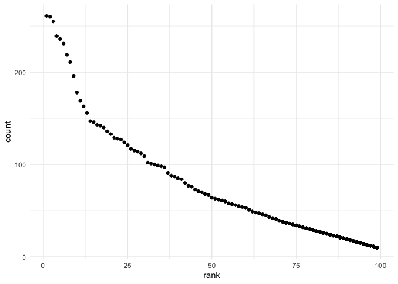

HW 2
================
AJ Catalano
11/4/2021

``` r
library(tidyverse)
```

    ## ── Attaching packages ─────────────────────────────────────── tidyverse 1.3.1 ──

    ## ✓ ggplot2 3.3.5     ✓ purrr   0.3.4
    ## ✓ tibble  3.1.5     ✓ dplyr   1.0.7
    ## ✓ tidyr   1.1.4     ✓ stringr 1.4.0
    ## ✓ readr   2.0.2     ✓ forcats 0.5.1

    ## ── Conflicts ────────────────────────────────────────── tidyverse_conflicts() ──
    ## x dplyr::filter() masks stats::filter()
    ## x dplyr::lag()    masks stats::lag()

``` r
library(readxl)
```

## Question 1

#### Reading and cleaning Mr. Trash Wheel data:

``` r
trash_data =
  read_excel("./data/Trash-Wheel-Collection-Totals-7-2020-2.xlsx",
             range = "Mr. Trash Wheel!A2:N535") %>%
  filter(Dumpster != "NA") %>%
  mutate_at("Sports Balls", round) %>%
  janitor::clean_names() %>%
  rename(dumpster_id = dumpster)
```

#### Reading and cleaning 2018 and 2019 precipitation data:

``` r
# 2018 data

precipitation_2018 =
  read_excel("./data/Trash-Wheel-Collection-Totals-7-2020-2.xlsx",
             range = "2018 Precipitation!A2:B14") %>%
  mutate(year = 2018) %>%
  relocate(year) %>%
  janitor::clean_names()

# 2019 data

precipitation_2019 =
  read_excel("./data/Trash-Wheel-Collection-Totals-7-2020-2.xlsx",
             range = "2019 Precipitation!A2:B14") %>%
  mutate(year = 2019) %>%
  relocate(year) %>%
  janitor::clean_names()
```

#### Combining 2018 and 2019 precipitation data:

``` r
precipitation_data = 
  bind_rows(precipitation_2019, precipitation_2018) %>%
  mutate(month = month.name[month])
```

The Mr. Clean Wheel dataset contains information about the contents of
454 dumpsters, including the weight (tons) and volume (
*y**d*<sup>3</sup>
) of trash and its type (e.g. plastic bottles, cigarette butts, and
sports balls). **In 2019, the median number of sports balls collected in
a dumpster was 9.**

The Precipitation dataset contains 24 monthly observations from 2018 -
2019 for total precipitation in inches. There are 3 variables in the
dataset. **The total precipitation in 2018 was 70.33**

## Question 2

Reading and cleaning pols_month data:

``` r
pols_data =
  read_csv("./data/fivethirtyeight_datasets/pols-month.csv") %>%
  separate(mon, into = c("year", "month", "day"), convert = TRUE) %>%
  mutate(month = month.name[month],
         president = recode(prez_gop, "0" = "dem", "1" = "gop", "2" = "gop")) %>%
         select(-prez_dem, -prez_gop, -day) %>%
  relocate(year, month, president)
```

    ## Rows: 822 Columns: 9

    ## ── Column specification ────────────────────────────────────────────────────────
    ## Delimiter: ","
    ## dbl  (8): prez_gop, gov_gop, sen_gop, rep_gop, prez_dem, gov_dem, sen_dem, r...
    ## date (1): mon

    ## 
    ## ℹ Use `spec()` to retrieve the full column specification for this data.
    ## ℹ Specify the column types or set `show_col_types = FALSE` to quiet this message.

Reading and cleaning snp data:

``` r
snp_data =
  read_csv("./data/fivethirtyeight_datasets/snp.csv") %>%
  mutate(date = lubridate::mdy(date)) %>%
  separate(date, into = c("year", "month", "day"), convert = TRUE) %>%
  mutate(year = ifelse(year > 2021, year - 100, year)) %>%
  arrange(year, month) %>%
  mutate(month = month.name[month]) %>%
  select(-day) %>%
  relocate (year, month)
```

    ## Rows: 787 Columns: 2

    ## ── Column specification ────────────────────────────────────────────────────────
    ## Delimiter: ","
    ## chr (1): date
    ## dbl (1): close

    ## 
    ## ℹ Use `spec()` to retrieve the full column specification for this data.
    ## ℹ Specify the column types or set `show_col_types = FALSE` to quiet this message.

Reading and cleaning unemployment data:

``` r
unemployment_data = 
  read_csv("./data/fivethirtyeight_datasets/unemployment.csv") %>%
  pivot_longer(
    Jan:Dec,
    names_to = "month",
    values_to = "unemployment_rate"
  ) %>%
  janitor::clean_names() %>%
  mutate(
    month = factor(month, levels = month.abb)) %>%
  arrange(month, year) %>%
  mutate(month = recode(month,
             Jan = "January", Feb = "February",
             Mar = "March", Apr = "April",
             May = "May", Jun = "June",
             Jul = "July", Aug = "August",
             Sep = "September", Oct = "October",
             Nov = "November", Dec = "December"))
```

    ## Rows: 68 Columns: 13

    ## ── Column specification ────────────────────────────────────────────────────────
    ## Delimiter: ","
    ## dbl (13): Year, Jan, Feb, Mar, Apr, May, Jun, Jul, Aug, Sep, Oct, Nov, Dec

    ## 
    ## ℹ Use `spec()` to retrieve the full column specification for this data.
    ## ℹ Specify the column types or set `show_col_types = FALSE` to quiet this message.

Merging SNP into Pols and then Unemployment:

``` r
data_538 = 
  left_join(pols_data, snp_data) %>%
  left_join(., unemployment_data)
```

    ## Joining, by = c("year", "month")
    ## Joining, by = c("year", "month")

The SNP dataset includes monthly S&P 500 closing prices from 1950, 2015.
The Unemployment dataset contains the monthly unemployment rate from
1948, 2015. The Pols dataset contains monthly entries on the political
party affiliation of major federal and state elected officials from
1947, 2015. The complete dataset, data_538, contains 11 variables and
822 observations.

## Question 3

``` r
# if childs first name and ethnicity are not converted to sentence, the resulting table in the next code chunk fails to create columns for 2011 and 2012. Why?!

pop_baby_names = 
  read_csv("./data/Popular_Baby_Names.csv") %>%
  janitor::clean_names() %>%
  mutate(
    ethnicity = recode(ethnicity,
                       "ASIAN AND PACIFIC ISLANDER" = "Asian and Pacific Islander",
                       "BLACK NON HISPANIC" = "Black non Hispanic",
                       "HISPANIC" = "Hispanic",
                       "WHITE NON HISPANIC" = "White non Hispanic",
                       "ASIAN AND PACI" = "Asian and Pacific Islander",
                       "BLACK NON HISP" = "Black non Hispanic",
                       "WHITE NON HISP" = "White non Hispanic"),
    gender = recode(gender,
                    "FEMALE" = "Female",
                    "MALE" = "Male"),
    childs_first_name = str_to_sentence(childs_first_name),
    ethnicity = str_to_sentence(ethnicity)) %>%
  distinct() %>%
  arrange(year_of_birth, ethnicity, rank)
```

    ## Rows: 19418 Columns: 6

    ## ── Column specification ────────────────────────────────────────────────────────
    ## Delimiter: ","
    ## chr (3): Gender, Ethnicity, Child's First Name
    ## dbl (3): Year of Birth, Count, Rank

    ## 
    ## ℹ Use `spec()` to retrieve the full column specification for this data.
    ## ℹ Specify the column types or set `show_col_types = FALSE` to quiet this message.

Making tables for the masses:

Produce a well-structured, reader-friendly table showing the rank in
popularity of the name “Olivia” as a female baby name over time; this
should have rows for ethnicities and columns for year.

``` r
pop_baby_names %>%
  filter(childs_first_name == "Olivia", gender == "Female") %>%
  select(ethnicity, year_of_birth, rank) %>%
  pivot_wider(
    names_from = year_of_birth,
    values_from = rank
  )
```

    ## # A tibble: 4 × 7
    ##   ethnicity                  `2011` `2012` `2013` `2014` `2015` `2016`
    ##   <chr>                       <dbl>  <dbl>  <dbl>  <dbl>  <dbl>  <dbl>
    ## 1 Asian and pacific islander      4      3      3      1      1      1
    ## 2 Black non hispanic             10      8      6      8      4      8
    ## 3 Hispanic                       18     22     22     16     16     13
    ## 4 White non hispanic              2      4      1      1      1      1

Produce a similar table showing the most popular name among male
children over time.

``` r
pop_baby_names %>%
  filter(gender == "Male", rank == 1) %>%
  select(ethnicity, year_of_birth, childs_first_name) %>%
  pivot_wider(
    names_from = year_of_birth,
    values_from = childs_first_name
  )
```

    ## # A tibble: 4 × 7
    ##   ethnicity                  `2011`  `2012` `2013` `2014` `2015` `2016`
    ##   <chr>                      <chr>   <chr>  <chr>  <chr>  <chr>  <chr> 
    ## 1 Asian and pacific islander Ethan   Ryan   Jayden Jayden Jayden Ethan 
    ## 2 Black non hispanic         Jayden  Jayden Ethan  Ethan  Noah   Noah  
    ## 3 Hispanic                   Jayden  Jayden Jayden Liam   Liam   Liam  
    ## 4 White non hispanic         Michael Joseph David  Joseph David  Joseph

Finally, for male, white non-hispanic children born in 2016, produce a
scatter plot showing the number of children with a name (y axis) against
the rank in popularity of that name (x axis).

``` r
pop_baby_names %>%
  filter(gender == "Male",
         ethnicity == "White non hispanic",
         year_of_birth == 2016) %>%
  ggplot(
    aes(x = rank, y = count)) +
  geom_point() +
  theme_minimal()
```

<!-- -->
